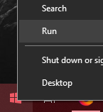
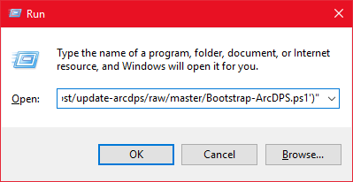
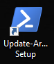
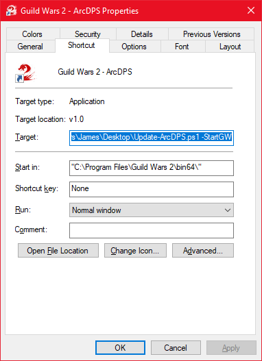

# Update-ArcDPS
#### Update ArcDPS and start Guild Wars 2 afterwards (so you can use a shortcut to this script instead of the traditional launcher)
---

### Why
[ArcDPS](https://www.deltaconnected.com/arcdps/) is a DPS meter addon provided by some cool dudes over at deltaconnected. It helps you to improve your own ability to play the game by giving you a better idea of how you're doing. It also shows you how everyone else is doing, and provides you the ability to be a total jerk to people who aren't as invested in the game as you. Don't do that. Help them understand more, and let them play the game on their own terms - if they really don't want to perform better on the meters, that's their own perogative. Let everyone have fun playing the game the way they want!

However, some of my guild mates had a hard time downloading ArcDPS or remembering how to keep it updated and a few other things. There are solutions out there for keeping it updated, but none of them were really "easy." I wanted a truly turnkey solution for them that would keep it updated through patches and bugfixes etc. This was my answer.

## Installation
#### There are two options, depending on how much you trust me.

### The easy way
1. Right click on your Start button and click "Run", or press Ctrl+R on your keyboard.
    
2. Copy the following and paste it into the "Open:" text box:
    ```
    powershell -c "[System.Net.ServicePointManager]::SecurityProtocol = [System.Net.SecurityProtocolType]::Tls12; ; iex(New-Object Net.WebClient).DownloadString('https://github.com/solacelost/update-arcdps/raw/0.3.7/Bootstrap-ArcDPS.ps1')"
    ````

    
3. Press OK on the Run dialog. Press Enter when prompted to close the window.
4. Double-click the Update-ArcDPS Setup shortcut on your desktop to pick up below at the -CreateShortcut point.
    

### The auditable way
1. Download the latest Release from [the releases page](https://github.com/solacelost/update-arcdps/releases).
1. Unzip it to the directory of your choice - the location doesn't matter
1. Review the script on your computer to ensure you're okay with what it does - you only need the Update-ArcDPS.ps1 script, not the Bootstrap. You can reach it via the [raw URL](https://raw.githubusercontent.com/solacelost/update-arcdps/0.3.7/Update-ArcDPS.ps1) and copy/paste, if you like.
1. Open a PowerShell window with the -executionpolicy Bypass option set and run the script with -CreateShortcut:
    1. Suppose you unzipped Update-ArcDPS.ps1 to your Desktop on the user named James.
    1. Right click on your Start button and click "Run", or press Ctrl+R on your keyboard.
    1. Type `powershell -executionpolicy bypass` into the "Open" text box and press "OK".
    1. You get a prompt that looks like this: `PS C:\Users\James>` and a blinking cursor.
    1. Run the script with the `-CreateShortcut` option switch set for initial setup and shortcut creation:
        Note: You may also choose to use the `-SearchPath "<PATH>"` parameter to change the default starting location that is searched to `<PATH>`.
        ```
        Desktop\Update-ArcDPS.ps1 -CreateShortcut
        ````

### Both methods of installation are now at this point
1. The script may hang while you see output like this during the first run:
    ```
    Looking for Guild Wars 2 in C:\Progra*
    GW2 path identified as C:\Program Files\Guild Wars 2.
    ```
1. This means it has already found Guild Wars 2 on your computer (It starts by looking in Program Files, but will expand to looking at every drive it can find)
    - If you have multiple GW2 installations (multiboxing), it will simply pick the first one it finds. If you're multiboxing, you can try using the -SearchPath option, potentially with the -Exact flag, to adjust the path you would like it to search. This is also helpful if it's unable to find your installation for some reason (usually due to strangely named foleders or complex pathing)
1. As part of setup, it will ask you some prompts regarding whether or how you want features enabled (Auto Update, Update-TacO, etc.). Answer with the letter "Y" or the letter "N" to the prompts as appropriate.
1. The script will go to the offical [ArcDPS installation sources](https://www.deltaconnected.com/arcdps/x64) and download everything, then create your shortcut and save the answers to the above questions in a file.
1. If you have chosen to enable Update-TacO alongside Update-ArcDPS there will be a longer delay as it reaches out and downloads the latest version of GW2TacO and Tekkit's Workshop marker pack, creating a dedicated shortcut for GW2TacO as well.

### Update-ArcDPS is now installed and configured
You can double-click on the "Guild Wars 2 - ArcDPS" shortcut to automatically update ArcDPS to the newest version then launch Guild Wars 2 every time.

If you have chosen to enable Update-ArcDPS to manage TacO and Tekkit's, then it will also update those at every launch and automatically launch GW2TacO when it notices that you have started your game client and gotten past the launcher. Please note that in order for GW2TacO to work, Guild Wars 2 must be in Windowed Fullscreen (Borderless) mode!

## Uninstallation
#### You need to run the script with the -Remove switch
The easiest way to do that is to manipulate the existing shortcut
1. Right click on the "Guild Wars 2 - ArcDPS" shortcut and select properties
    
1. At the end of the "Target:" textbox, you should see `-StartGW`. Replace that with `-Remove` and click "OK" to save the shortcut.
1. Double-click the modified shortcut. Update-ArcDPS will remove the shortcut as part of the uninstallation, too, so it's all gone!
1. If you have enabled Update-TacO functionality, this will also remove GW2TacO, all saved data, and all of the Update-TacO artifacts.
