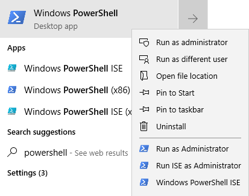
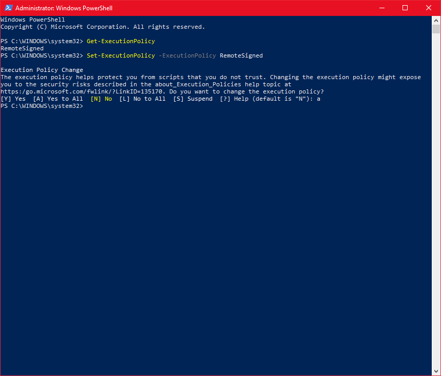
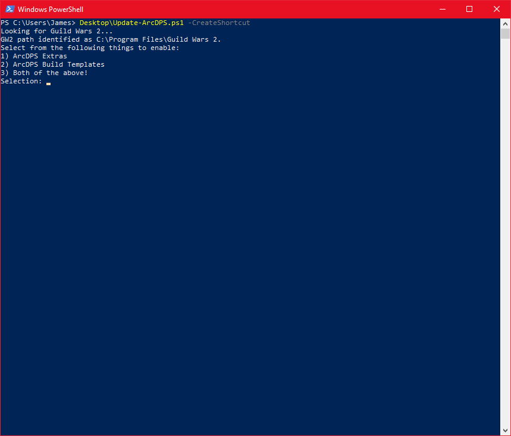
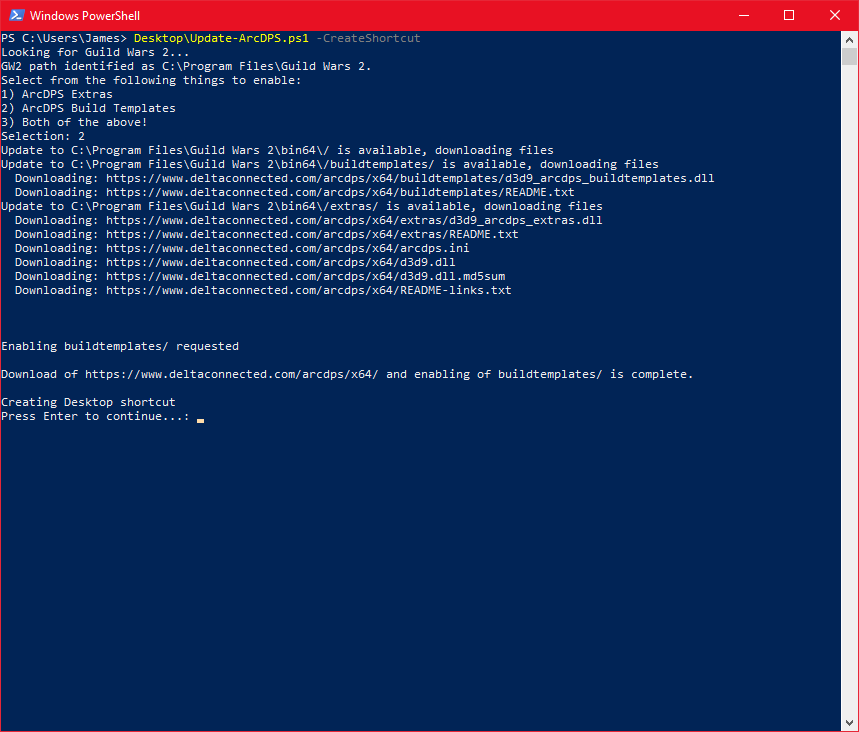
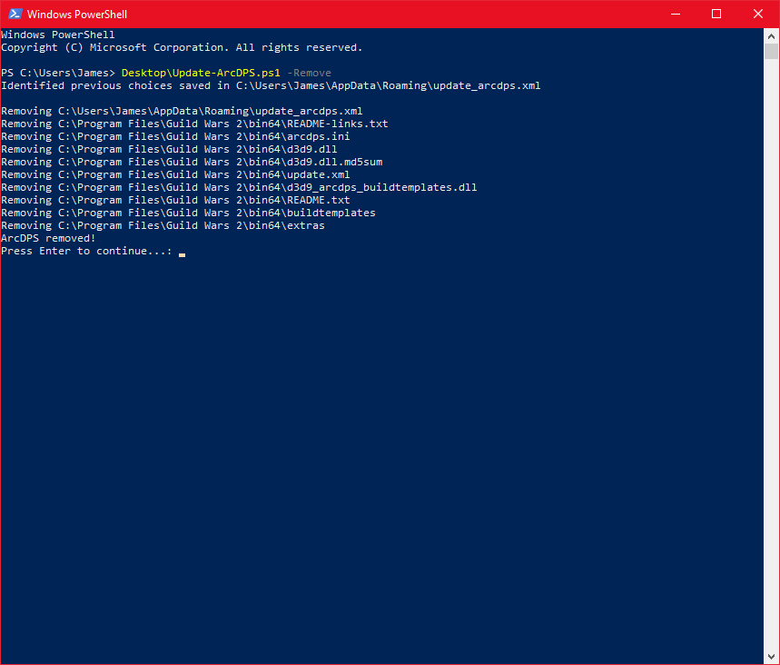

# Update-ArcDPS
#### Update ArcDPS and optionally Start Guild Wars 2 after (so you can use a shortcut to this script instead of the traditional launcher)
---

## Installation
#### It's just a script, man. Put it where you want.
1. Download the latest Release from [the releases page](https://github.com/solacelost/update-arcdps/releases) or right click [a link to the raw master](https://raw.githubusercontent.com/solacelost/update-arcdps/master/Update-ArcDPS.ps1) and choose "Save Link As..." or equivalent to grab just the .ps1 file.
1. If you downloaded a Release, unzip it to the directory of your choice
1. Ensure you've enabled the running of PowerShell scripts
    1. I recommend RemoteSigned as the appropriate execution policy
    1. Click Start or press the Windows key on your keyboard
    1. Type "powershell"
    1. Right click the "Windows Powershell" Desktop app
    1. Choose "Run as administrator" like here:
        
    1. Type `Get-ExecutionPolicy` to see what your execution policy is currently set to
    1. Type `Set-ExecutionPolicy -ExecutionPolicy RemoteSigned` to enable the reocmmended policy configuration
    1. Enter letter `a` to say `Yes to All` if prompted, like shown below:
        
1. Unblock the running of this file, if it's detected as running from a remote source (e.g. downloaded from the internet...)
    1. Suppose you unzipped Update-ArcDPS.ps1 to your Desktop on the user named James
    1. Click Start or press the Windows key on your keyboard
    1. Type "powershell" and click on the "Windows Powershell" desktop app (no admin necessary)
    1. You get a prompt that looks like this: `PS C:\Users\James>` and a blinking cursor.
    1. You could type the following to mark the file as locally-accepted:
        `Unblock-File Desktop\Update-ArcDPS.ps1`
    1. You can also specify the absolute path to the file, if you've put it in a strange directory.
1. Run the script with the -CreateShortcut option switch set for initial setup and shortcut creation
    1. Suppose you unzipped Update-ArcDPS.ps1 to your Desktop on the user named James
    1. If you don't have a PowerShell window open, Click Start or press the Windows key on your keyboard
    1. Type "powershell" and click on the "Windows Powershell" desktop app (no admin necessary)
    1. You get a prompt that looks like this: `PS C:\Users\James>` and a blinking cursor.
    1. You could type the following to run the script initially and create the shortcut:
        `Desktop\Update-ArcDPS.ps1 -CreateShortcut`
    1. You will see output like this during the first run:
        
    1. This means it has already found Guild Wars 2 on your computer (It starts by looking in Program Files, but will expand to looking at every drive it can find)
        - If you have multiple GW2 installations (multiboxing), it will not be able to decide which one to use. If you're multiboxing, I suspect you can dig through the script and figure out what to change. It's not going to officially be supported, sorry.
    1. Select the addons you would like to enable (reference the [ArcDPS README](https://www.deltaconnected.com/arcdps/) for information about these addons... I like Build Templates)
    1. The script will go to the offical [ArcDPS installation sources](https://www.deltaconnected.com/arcdps/x64) and download everything, then create your shortcut and save the answers to the above queries/detections in a file. The final output will look something like this:
        
    1. You can double-click on the "Guild Wars 2 - ArcDPS" shortcut to automatically update ArcDPS to the newest version, then launch Guild Wars 2 every time.

## Uninstallation
#### You have a couple of options for how to go about uninstalling ArcDPS and my update script:
1. Manually running the script
    1. Suppose you unzipped Update-ArcDPS.ps1 to your Desktop on the user named James
    1. If you don't have a PowerShell window open, Click Start or press the Windows key on your keyboard
    1. Type "powershell" and click on the "Windows Powershell" desktop app (no admin necessary)
    1. You get a prompt that looks like this: `PS C:\Users\James>` and a blinking cursor.
    1. You could type the following to run the script in uninstallation mode:
        `Desktop\Update-ArcDPS.ps1 -Remove`
    1. You will see output like this:
        
1. Manipulating the shortcut
    1. If there's already a shortcut to Update-ArcDPS on your desktop (created with the -CreateShortcut option), you can just edit it!
    1. Right click on the "Guild Wars 2 - ArcDPS" shortcut and select properties
        
    1. At the end of the "Target:" textbox, you should see `-StartGW`. Replace that with `-Remove` and click "OK" to save the shortcut.
    1. Double-click the shortcut like normal. Update-ArcDPS will remove the shortcut as part of the uninstallation, too, so it's all gone!

## Operation
#### How to use the script to keep ArcDPS up to date.
1. Literally just double-click the shortcut, instead of your normal Guild Wars 2 shortcut.
    1. It'll update ArcDPS if there's been a new release automatically, then start Guild Wars 2 for you.
    1. It won't ever go looking for the Guild Wars 2 directory again.
    1. You gotta trust those ArcDPS guys more than you trust me.
1. That's it.

## To do:
- [x] Make it better than it used to be
- [ ] Provide for auto-update of Update-ArcDPS (wow that's meta)
- [ ] Make a real installer of some sort, or at least require less interactivity, since people seem to have a hard time with ExecutionPolicy
